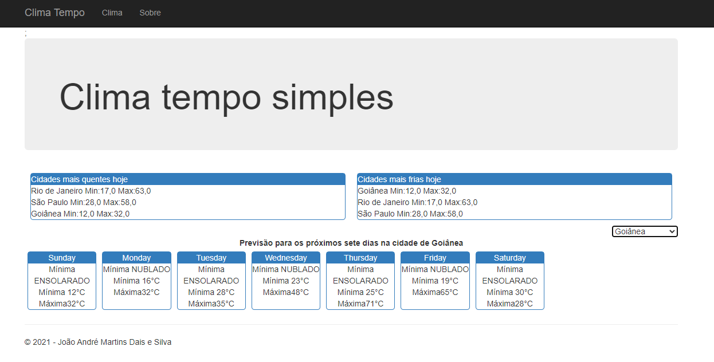

# ClimaTempoSimples
Tecnologias utilizadas: .NET 4.6.1, .NET MVC 5.2.7 and Entity Framework 6, Unity IoC Container
Para utilizar o projeto basta Fazer o dowload, abrir a sln no Visual Studio 2019, adicionar sua string de conexao ao arquivo WebConfig em CTSimples.  
Para criação e preenchimento da base de testes utilizar os scripts SQL disponibilizados na pasta SQLScripts, na ordem descrita:
1 - Create Database.sql
2 - Create Table.Sql
3 - ClimaTempoSimplesFillData.SQL

